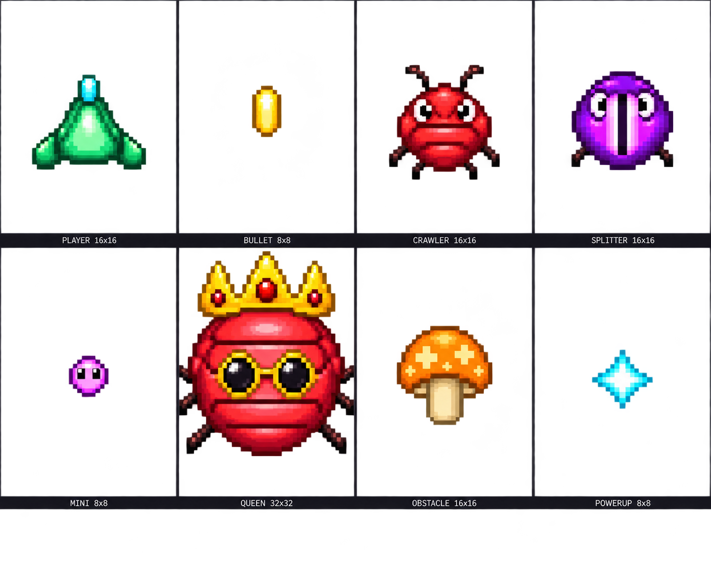
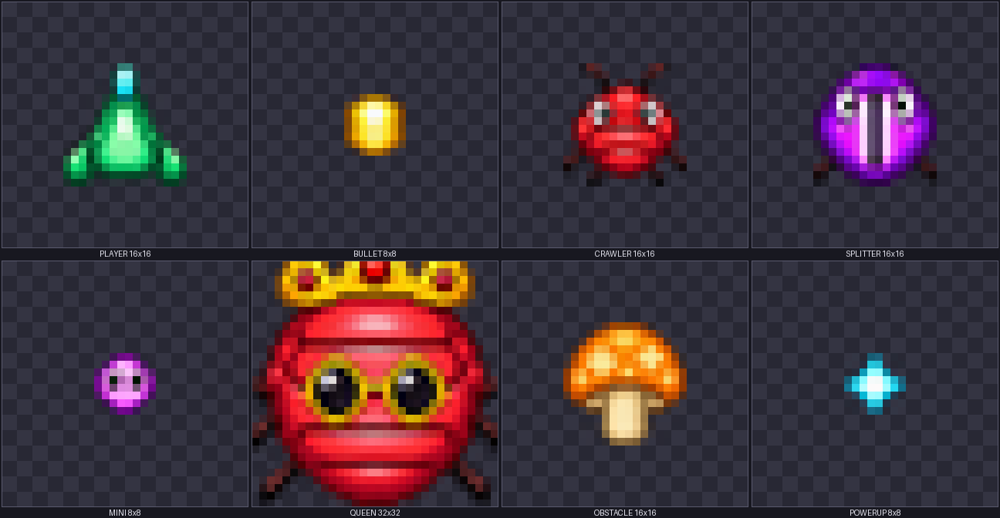
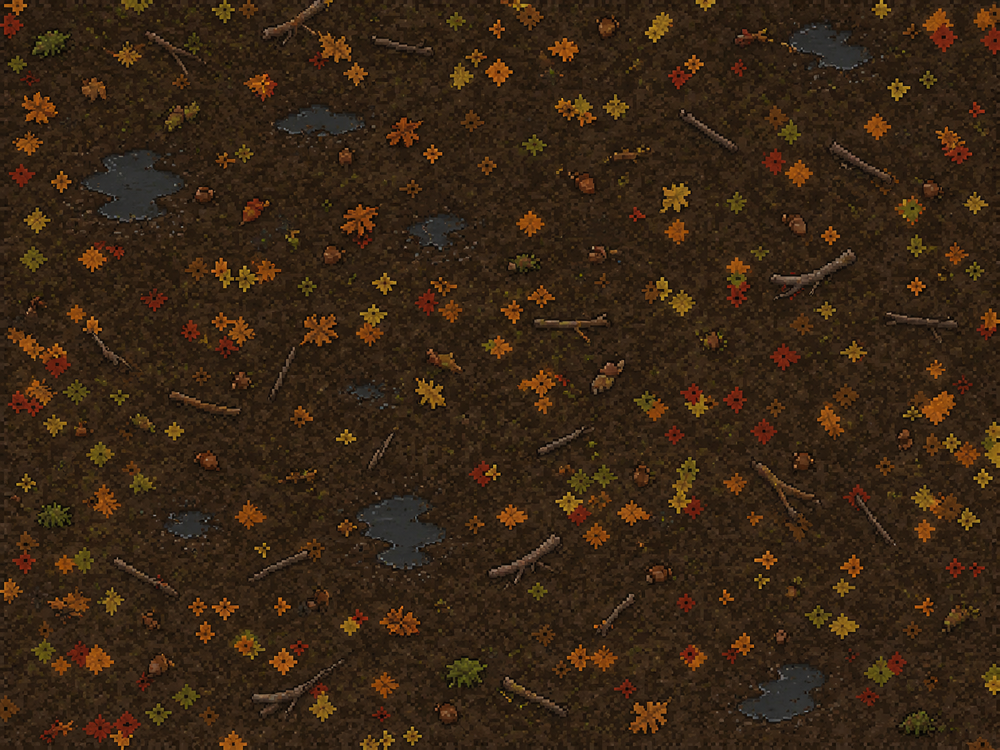
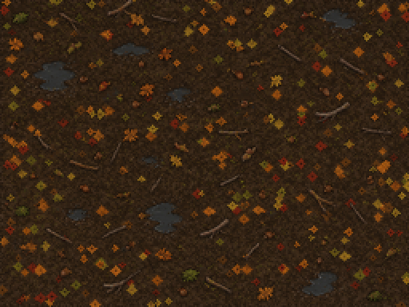
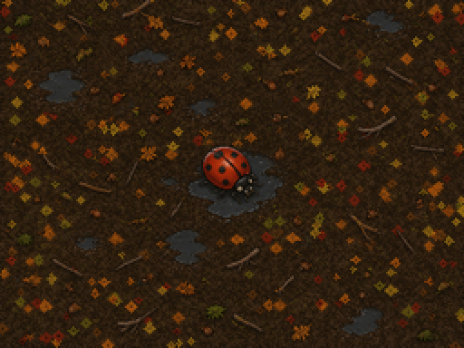
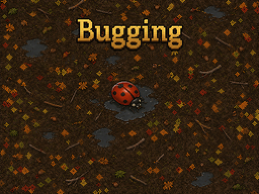
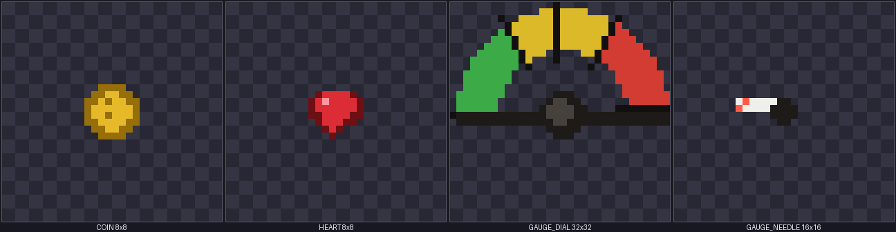
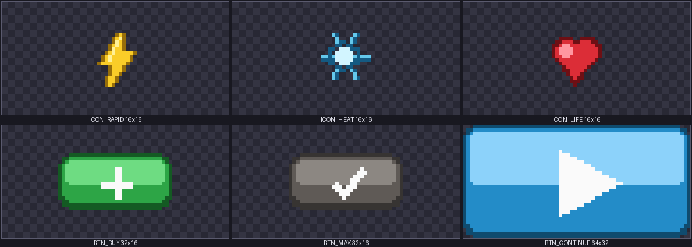
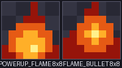

# Bug Swarm (Nintendo DS)

*Survive the swarm.*

A small Centipede/Galaxian-inspired fixed shooter for the Nintendo DS, built
with **libnds** (devkitARM), in the spirit of an early-80s arcade cabinet:
few colors, small shapes, a static playfield backdrop.

## Art

**Sprites** — the source of truth is the hand-drawn
[`tools/spritesheet_preview.png`](tools/spritesheet_preview.png) (a 4x2 grid,
one cell per sprite, each labeled "NAME WxH" like the sheet below).
[`tools/import_spritesheet.py`](tools/import_spritesheet.py) locates each
cell, auto-crops it to its artwork (ignoring the caption bar), resizes it
down to the sprite's native in-game size with a quality filter, and emits:

- `source/spritesheet_data.h` — RGB15+alpha pixel data `source/sprites.c`
  `memcpy`s into VRAM at boot (generated — don't hand-edit it).
- `tools/spritesheet_ingame_preview.png` — the same data at true size
  (scaled 10x with nearest-neighbor so it's inspectable), i.e. exactly what
  the DS will actually draw. Sprite art can look great at high-res and still
  turn to mush at 8x8/16x16, so check this before trusting the big sheet.

To change the art: edit `spritesheet_preview.png` in an image editor
(keep the grid/label layout so the importer can still find each cell), then:

```bash
python tools/import_spritesheet.py   # re-extracts every sprite, then rebuild
```

[`tools/gen_sprites.py`](tools/gen_sprites.py) is the original procedural
(Pillow-drawn) placeholder set — still handy as a quick way to regenerate a
correctly-laid-out starting sheet from scratch if the grid ever gets lost.

Sheet (source art):


In-game (true size, what actually ships):


**Background** — the source of truth is the hand-drawn
[`tools/background_preview.png`](tools/background_preview.png), the top
screen's backdrop (an autumn forest floor: soil, scattered leaves, twigs,
puddles). [`tools/import_background.py`](tools/import_background.py)
downsamples it to the DS top screen's native 256x192 with a quality filter
and writes:

- `data/forest_floor.bg.bin` — raw RGB15 pixels. The Makefile's `DATA` rule
  embeds it into the ROM automatically (via `bin2s`); `source/background.c`
  uploads it to BG3 (a 256x256 16-bit bitmap background, main engine) once
  at startup, behind every sprite.
- `tools/background_ingame_preview.png` — the downsampled 256x192 result
  (scaled 2x), i.e. what the DS actually shows. A detailed source image can
  turn to mush once it's squeezed down, so check this before trusting the
  big source file.

To change it: edit `background_preview.png` in an image editor (any size,
same 4:3 aspect ratio as the screen), then:

```bash
python tools/import_background.py   # re-downsamples it, then rebuild
```

[`tools/gen_background.py`](tools/gen_background.py) is the original
procedural (Pillow-drawn) placeholder — still handy to regenerate a fresh
starting image from scratch.

Source art:


In-game (true size, what actually ships):


**Game-over screen** — [`tools/gameoverscreen.png`](tools/gameoverscreen.png)
(same forest floor, with a dead ladybug on a puddle) replaces the BG3
backdrop while `STATE_GAMEOVER` is active.
[`tools/import_gameover.py`](tools/import_gameover.py) downsamples it the
same way as the background, into `data/gameover.bg.bin` +
`tools/gameoverscreen_ingame_preview.png`. `source/background.c` keeps both
images' data around and swaps BG3's pixels with a single `dmaCopy` on the
state transition (`background_show_gameover()` / `background_show_forest()`,
called from `source/game.c`) rather than redrawing anything per frame.

```bash
python tools/import_gameover.py   # after replacing gameoverscreen.png, then rebuild
```



**Title screen** — [`tools/titlescreen.png`](tools/titlescreen.png) (the
game's logo baked right into the art) replaces the BG3 backdrop while
`STATE_TITLE` is active; same `import_titlescreen.py` → `data/titlescreen.bg.bin`
→ `background_show_title()` pipeline as the game-over screen. Since the
logo now lives in the art, the sub-screen title text is just the control
hints (centered) and the START/SELECT/high-score lines - no more separate
"BUG SWARM" text over it.

```bash
python tools/import_titlescreen.py   # after replacing titlescreen.png, then rebuild
```



**HUD icons/gauge** — [`tools/gen_hud_sprites.py`](tools/gen_hud_sprites.py)
draws the coin, heart, and analog heat-gauge art the same way
(Pillow → `source/hud_sprites_data.h` + a preview PNG). The heat gauge is a
real dial: a static semicircular face (`GAUGE_DIAL`, green/yellow/red
zones) plus a separate needle sprite (`GAUGE_NEEDLE`) that `source/hud.c`
spins with the DS's affine sprite hardware (`oamRotateScale`) each frame,
rather than redrawing anything.

```bash
python tools/gen_hud_sprites.py   # after editing a draw_*() function, then rebuild
```



**Shop icons/buttons** — [`tools/gen_shop_sprites.py`](tools/gen_shop_sprites.py)
draws the shop's upgrade icons and tappable buttons the same way (Pillow →
`source/shop_sprites_data.h` + a preview PNG): a bolt, snowflake, and heart
icon, a green "+" buy button, a grey checkmark "maxed" button, and a big
blue play-button for Continue.



**Flamethrower weapon** — [`tools/gen_weapon_sprites.py`](tools/gen_weapon_sprites.py)
draws the flamethrower pickup icon and its flame-particle "bullet" the same
way (Pillow → `source/weapon_sprites_data.h` + a preview PNG).



## Build

Requires [devkitPro](https://devkitpro.org/) with the `nds-dev` package
(devkitARM + libnds + grit + ndstool).

```bash
export DEVKITPRO=/opt/devkitpro
export DEVKITARM=$DEVKITPRO/devkitARM
make
```

This produces `BugSwarm.nds`, runnable on a flashcart or in an emulator
(melonDS, DeSmuME, no$gba...).

> **Note on this environment:** devkitPro ships its own private MSYS2 runtime
> (mounted internally at `/opt/devkitpro`), separate from Git-Bash's MSYS2 on
> this machine. Building from a plain Git-Bash prompt fails with
> `DEVKITARM` / recursive-`make` errors because the two runtimes don't share
> an environment or path table. Build through devkitPro's own shell instead:
> `C:\devkitPro\msys2\usr\bin\bash.exe -lc "cd '<project path>' && make"`.
> Its `/etc/profile` already exports `DEVKITPRO`/`DEVKITARM` correctly.

## Controls

| Input | Action |
|---|---|
| Touch screen (drag) | Move the cannon / tap a key on the initials keyboard / tap a shop row |
| D-Pad Left/Right | Move the cannon, or move across a row of keys/menu items |
| D-Pad Up/Down | Move between rows on the initials keyboard or in the shop |
| A (tap / hold) | Fire (hold for sustained fire, limited by the heat gauge) / confirm a menu selection |
| START | Start / restart / confirm |
| SELECT | View the leaderboard (from the title screen) |

The concept draft imagined the stylus alone handling both movement *and*
tap-to-fire. I split that into touch-or-D-Pad for movement plus a dedicated
fire button instead — closer to the original arcade Centipede's
trackball-plus-button layout, and it avoids the ambiguity of a drag gesture
also being read as a fire input. L/R are reserved for a future special
weapon (see Roadmap).

## Screens

- **Top screen:** the playfield — cannon, bugs, bullets, obstacles,
  power-ups — plus two HUD overlays drawn as ordinary sprites
  (`hud_render_overlay()`), always on top of gameplay: an analog **heat
  gauge** bottom-right (a real dial with green/yellow/red zones and a
  needle that rotates via the DS's affine sprite hardware, not a bar) and
  **combo pips** bottom-left (one lit per combo level, up to `COMBO_MAX`).
  Both sit above the cannon's row so they're never covered by it.
- **Bottom screen:** score as text (high score and phase are shown on the
  title/game-over screens instead, not during play, to keep this screen
  focused), plus a set of graphical widgets drawn as hardware sprites
  (`source/hud.c`) on their own sub-screen sprite layer, sitting on top of
  the text: a **cannon-position marker**, at the top of the screen, that
  tracks the ship at full pixel precision (not snapped to the text grid);
  a **coin icon** flush against the coin count; **heart icons** for lives
  (up to 6, then a "+N" falls back to text); and an 8-segment **multi-shot
  bar** that depletes as the power-up runs out. Also the touch surface
  used to steer.

## What's implemented

- Movement, firing with a cooldown + overheat gauge, and a combo multiplier
  that grows on consecutive hits and resets on a miss or a hit taken.
  Reaching a 5-combo also grants 2 free triple-shots on top of the next
  normal shots (`player.comboMultiShots`, `game_add_score()`) - a small,
  count-based reward, separate from and stacking with the MULTI power-up's
  timer.
- **Crawler**: zigzags and slowly descends. Non-mini Crawlers have a 5%
  chance to drop the **flamethrower** power-up on death. While it's active
  (`player.flameTimer`), firing switches from an aimed shot to a rapid,
  short-range spray of flame particles (`bullet_spawn_flame()`) - fast
  cooldown, low range, low heat per particle but it adds up fast if held.
- **Splitter**: splits into two fast mini-crawlers when destroyed.
- **Queen**: a boss that appears once the swarm reaches Phase 5; defeating
  her scores 5000 and starts a new, harder cycle (Phase 1 again, but faster).
- Destructible mushroom obstacles that block shots and occasionally drop a
  power-up when destroyed, and shake for a few frames on every hit
  (`Obstacle.shakeTimer`, `obstacle_render()`) even if they survive it;
  bugs steer around them.
- Two power-ups: **MULTI** (triple shot), dropped occasionally by
  destroyed obstacles (and any killed bug, `PowerupType`/`powerup_spawn()`),
  and **flamethrower** (see Crawler, above).
- Five difficulty phases (Invasion → Swarm → Panic → Overrun → Queen) that
  scale spawn rate and bug speed, looping with escalating difficulty after
  each Queen kill.
- Title screen, game over screen, and an in-session high score.
- **A persisted top-8 leaderboard.** A Game Over that beats the lowest board
  entry (or the board isn't full yet) drops you into a touch/D-Pad QWERTY
  keyboard to enter 3 initials, then shows the ranked board with your new
  entry highlighted. The board is saved to `/bugswarm_scores.dat` via
  `libfat` and reloaded on boot, so it survives a power cycle. Press SELECT
  from the title screen to view it any time.
- **Coins and a post-boss shop.** Killing bugs and destroying obstacles
  earns coins (the Queen pays out 50). Every time the Queen dies, the game
  pauses and opens a shop (sub-screen). Each upgrade is an icon (bolt =
  Rapid Fire, snowflake = Heat Resist, heart = Extra Life) next to a
  tappable button sprite — green "+" to buy, grey checkmark once a 5-level
  upgrade (Rapid Fire shortens the fire cooldown, Heat Resist lowers heat
  per shot) hits its cap; Extra Life has no cap, just a flat cost. A big
  blue play-button ends the shop and resumes the run at the next, harder
  cycle. D-Pad+A works too (Up/Down moves a `>` cursor, A activates).
  Coins reset with each new run, same as score.

## Save data

The leaderboard needs somewhere to write `/bugswarm_scores.dat` — a
flashcart's SD card, an emulator's virtual SD/DLDI folder (melonDS and
DeSmuME both offer one), or a DSi/3DS's SD card. If `fatInitDefault()` can't
find any storage, the game still runs and keeps a board for that session
only; the leaderboard screen shows "(not saved: no storage found)" so it's
obvious when that's happening rather than silently losing scores.

## Roadmap (not yet built)

The original concept describes more than a first version needs — these are
intentionally left out so far, per "erst die 5 Basics, dann Schritt für
Schritt erweitern":

- **Jumper** and **Hunter** bug types.
- The other four power-ups (LASER, RAPID, SHIELD, FREEZE) and a dedicated
  L/R special weapon.
- Sound effects / music (no `maxmod` integration yet).
- Bugs currently only steer *around* obstacles; they don't yet damage them
  or use them as cover.
- Shop prices/coin payouts are a first pass, not balanced by actual
  playtesting — easy to retune, they're all named constants in `globals.h`
  (`COINS_*`, `UPGRADE_*`, `EXTRA_LIFE_COST`).

**Unverified:** the heat-gauge needle's rotation *direction* (`source/hud.c`,
`hud_update_playing()`) is implemented per libnds's documented "ccw angle"
convention for `oamRotateScale`, but I have no emulator in this environment
to confirm it visually sweeps left→right (cold→hot) through the top of the
dial as intended, rather than the reverse or through the bottom. If it
looks wrong on real hardware/an emulator, flip the sign of the `angle`
calculation there - one line. (A related bug, where the sweep went a full
360° instead of 180°, is fixed: libnds' full circle is
`DEGREES_IN_CIRCLE = 32768`, not 65536 as I'd first assumed.)

## Project layout

```
source/
  main.c       entry point, video/OAM setup, main loop
  game.c/.h    state machine, scoring/combo, collisions, HUD text
  player.c/.h  cannon: input, firing, heat, lives
  bullet.c/.h  bullet pool
  bug.c/.h     Crawler / Splitter / Queen behaviour
  obstacle.c/.h  mushrooms
  powerup.c/.h   MULTI/flamethrower pickups
  leaderboard.c/.h loads/saves/renders the top-8 board (libfat)
  keyboard.c/.h    on-screen QWERTY keyboard for entering initials
  shop.c/.h        post-boss upgrade shop
  hud.c/.h         coin/heart/indicator/multi-bar sprites (sub) + heat gauge/combo pips (main)
  sprites.c/.h     loads baked sprite pixel data into VRAM
  background.c/.h  swaps BG3 between the forest-floor/game-over/title bitmaps
data/
  forest_floor.bg.bin  raw RGB15 background pixels (generated, embedded via bin2s)
  gameover.bg.bin      raw RGB15 game-over-screen pixels (generated, embedded via bin2s)
  titlescreen.bg.bin    raw RGB15 title-screen pixels (generated, embedded via bin2s)
tools/
  spritesheet_preview.png   source sprite art (hand-edit this)
  import_spritesheet.py     extracts it into source/spritesheet_data.h + an in-game-size preview
  gen_sprites.py             regenerates a fresh placeholder spritesheet_preview.png from scratch
  background_preview.png    source background art (hand-edit this)
  import_background.py      downsamples it into data/forest_floor.bg.bin + an in-game-size preview
  gen_background.py         regenerates a fresh placeholder background_preview.png from scratch
  gameoverscreen.png        source game-over art (hand-edit this)
  import_gameover.py        downsamples it into data/gameover.bg.bin + an in-game-size preview
  titlescreen.png           source title-screen art (hand-edit this)
  import_titlescreen.py     downsamples it into data/titlescreen.bg.bin + an in-game-size preview
  gen_hud_sprites.py        generates source/hud_sprites_data.h + the HUD sprite preview PNG
  gen_shop_sprites.py       generates source/shop_sprites_data.h + the shop sprite preview PNG
  gen_weapon_sprites.py     generates source/weapon_sprites_data.h + the weapon sprite preview PNG
```
